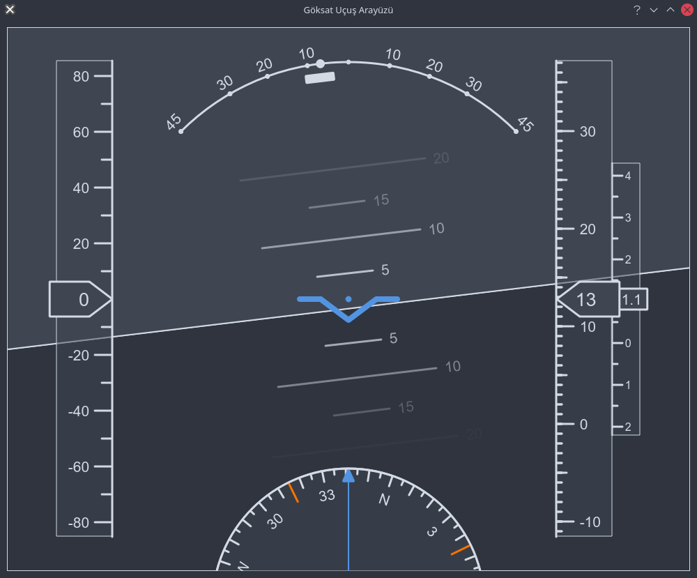
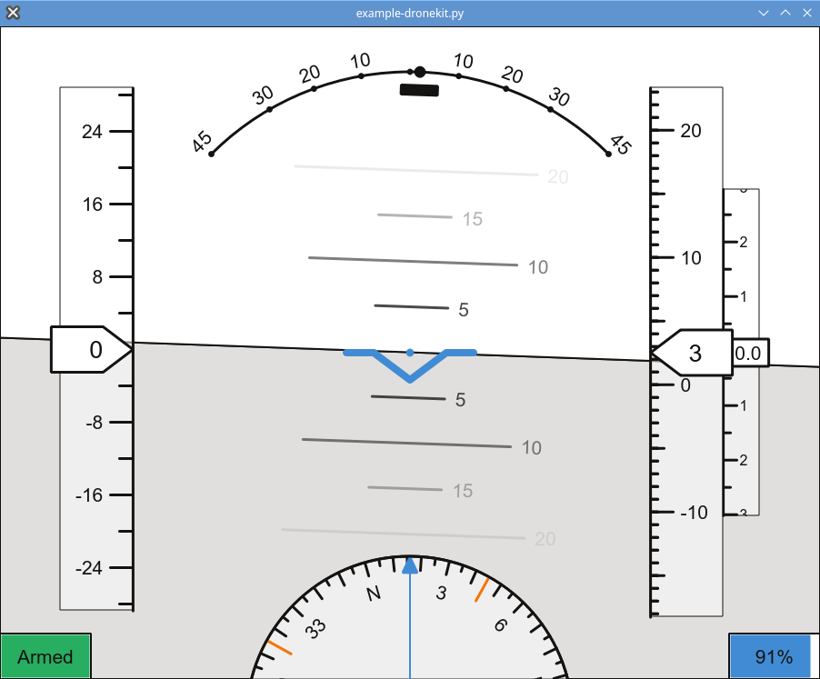
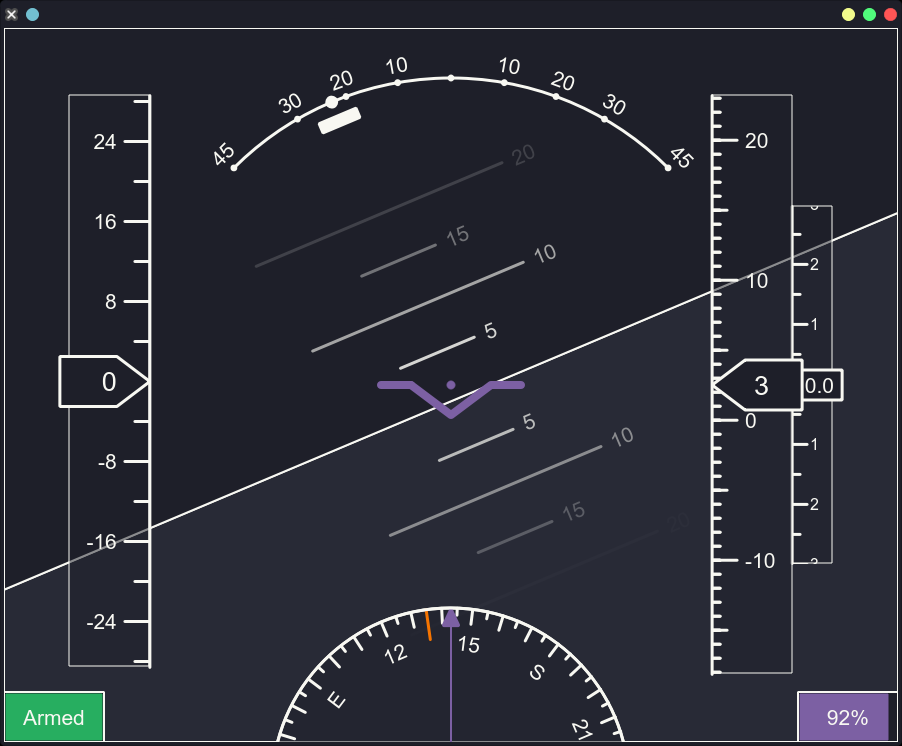
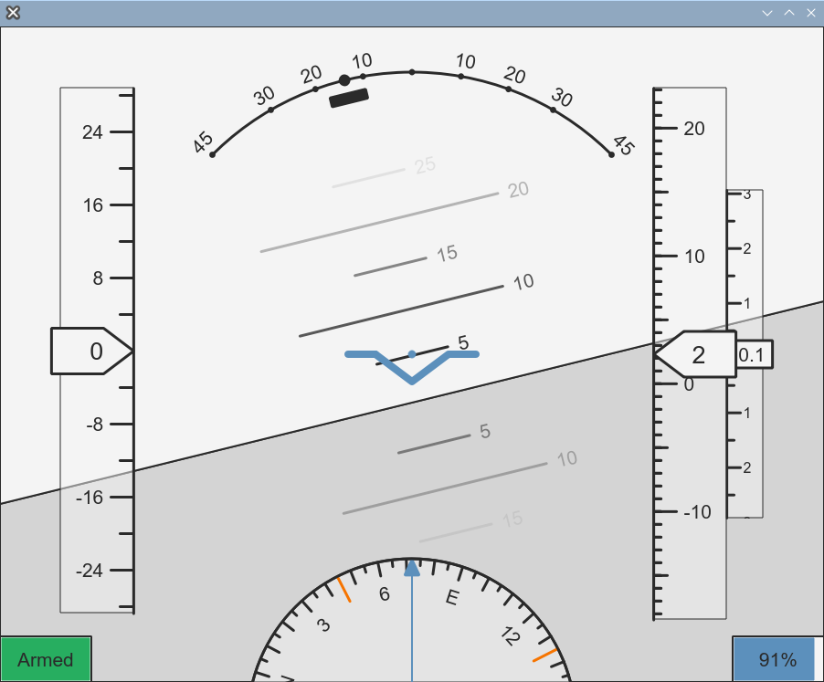

# QPrimaryFlightDisplay

T-standard compliant primary flight display widget for showing realtime flight data

# Features

- It provides a single display with standard flight instruments.
- Automatically uses current Qt theme to draw the display.
- Arbitrary display ratios and UI scaling is supported.
- Easy to use and easy to embed (see examples).
- Custom widget created using the drawing primitives, only base Qt framework is required.
- Can be used as a standalone application or as a widget in a larger application.
- Supports both PySide2 and PySide6.
- Now with support OpenGL rendering for better performance.

# Dependencies
Any of the following dependencies are required:

- PySide2 or PySide6: https://wiki.qt.io/Qt_for_Python

# Installation

Clone the repository and install the package using pip,

```
git clone https://github.com/shadymeowy/QPrimaryFlightDisplay
pip install QPrimaryFlightDisplay/
```

or simply install directly from the GitHub repository,

```
pip install git+https://github.com/shadymeowy/QPrimaryFlightDisplay
```


# Screenshots




