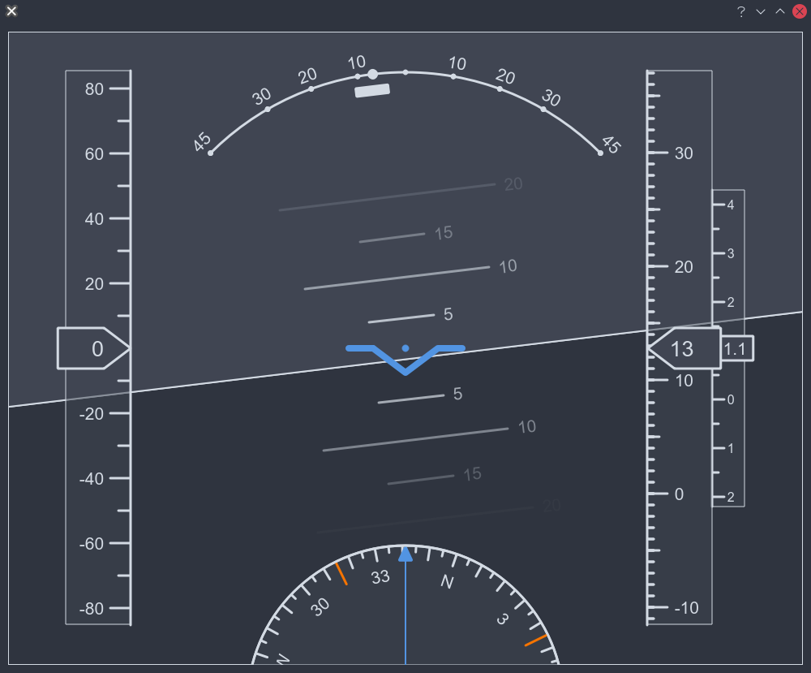

# QPrimaryFlightDisplay

T-standard compliant primary flight display widget for showing realtime flight data.

# Features

- It provides a single display with standard flight instruments.
- Automatically uses current Qt theme to draw the display.
- Arbitrary display ratios and UI scaling is supported.
- Easy to use and easy to embed (see examples).
- Custom widget created using the drawing primitives, only base Qt framework is required.
- CPU usage is kept low as much as possible.

# Dependencies
Any of the following dependencies are required:

- PySide2 or PySide6: https://wiki.qt.io/Qt_for_Python

# Screenshots

